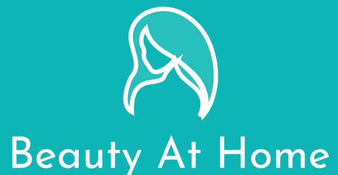

<!--
*** Thanks for checking out the Best-README-Template. If you have a suggestion
*** that would make this better, please fork the repo and create a pull request
*** or simply open an issue with the tag "enhancement".
*** Don't forget to give the project a star!
*** Thanks again! Now go create something AMAZING! :D
-->

<!-- PROJECT LOGO -->
 

  

  <h3 align="center">Beauty At Home</h3>

  

    A system enables booking beauty services at home with ease!
     
    <a href="https://github.com/othneildrew/Best-README-Template">View Demo</a>
    ·
    <a href="https://github.com/thehienvnag/beauty-at-home/issues">Request Feature</a>
  

<!-- PROJECT GITHUB LINKS -->
## Project's Github links
<ul>
  <li>
    <a href="https://github.com/thehienvnag/beauty_at_home_customer">Customer mobile app</a>
  </li>
  
  <li>
    <a href="https://github.com/donglong-ops/beauty-at-home-provider-mobile">Beauty Artist mobile app</a>
  </li>
  
  <li>
    <a href="https://github.com/thehienvnag/beauty_at_home_web_admin">Admin web app</a>
  </li>
  
  <li>
    <a href="https://github.com/thehienvnag/beauty_at_home_backend">Back-end</a>
  </li>
</ul>

<!-- ABOUT THE PROJECT -->
## About The Project

* Going to Beaty salon usually takes a lot of time. 
* Women nowsaday is more and more busy with their career. 
* Small salon can only serve few guests at a time due to lacks of parking slot or small space.
* Freelancer beauty artist can only serve patrons or work for salon.
-> In order to connect freelancer beauty artist and customer, we have built a system which provides beauty services booking.
 
 
This project is for our class assignment projects, Beauty At Home supports following functions:
* Admin can accept registration of beauty artist and view customer’s feedback to beauty artist.
* Beauty artist can manage their services that they offer to their customer, and they can manage 
their orders from the customer.
* Beauty At Home allows visitors to book for at-home beauty services and give feedbacks to the 
services they received.

### Built With
The followings is technologies and frameworks used in our project:

* **Mobile app**: Flutter, Provider for state management 

* **Web application**: Vue.js, Vuex for state management, Ant Design for UI library. 

* **Backend**: C# .NET 5, Entity Framework Core, SQL Server. 

* **Push notification and File storage**: Firebase. 

                                            
<!-- CONTACT -->
## Contact

Huỳnh Thế Hiển - [@Thế_Hiển](https://www.facebook.com/thehienvnag) - thehienvnag@gmail.com

(<a href="#top">back to top</a>)

